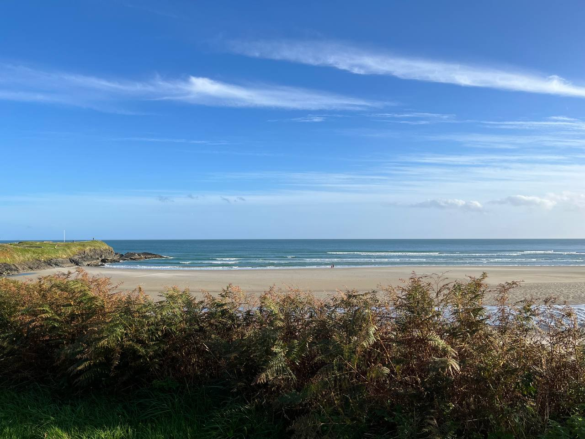
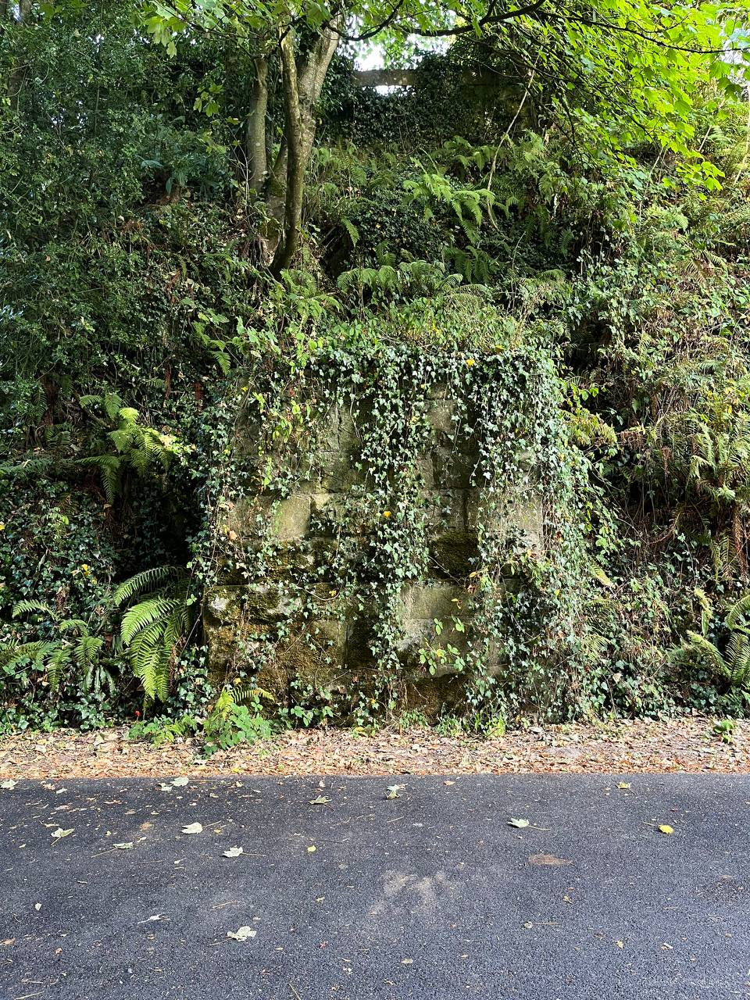
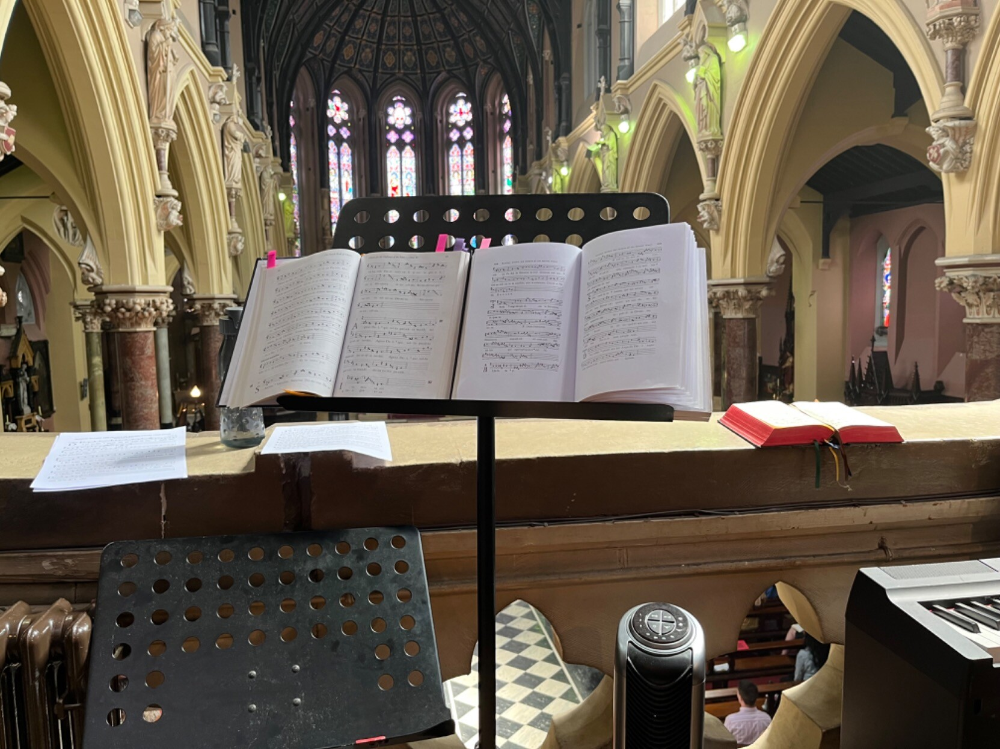
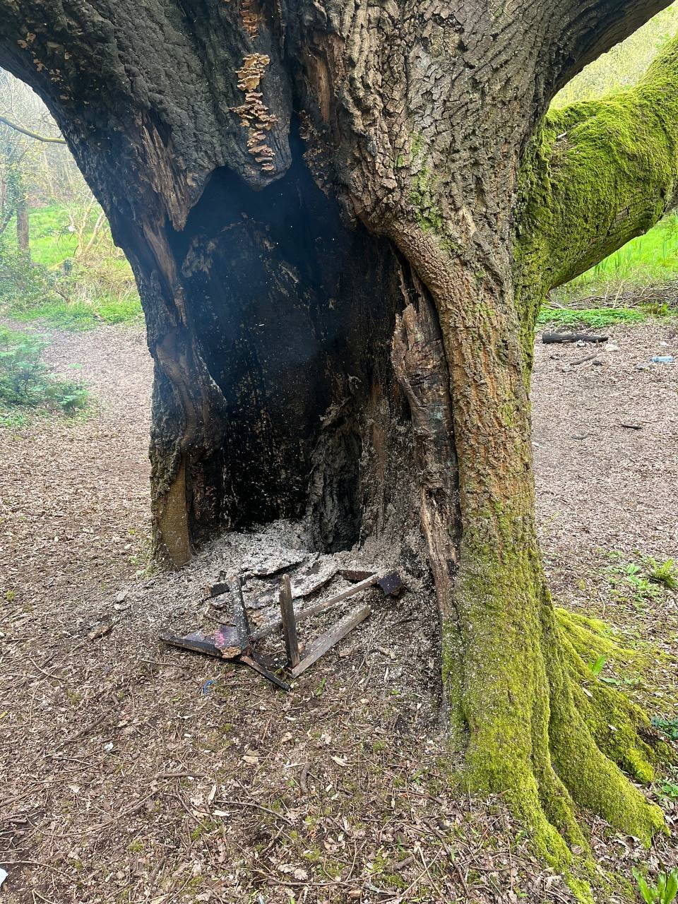
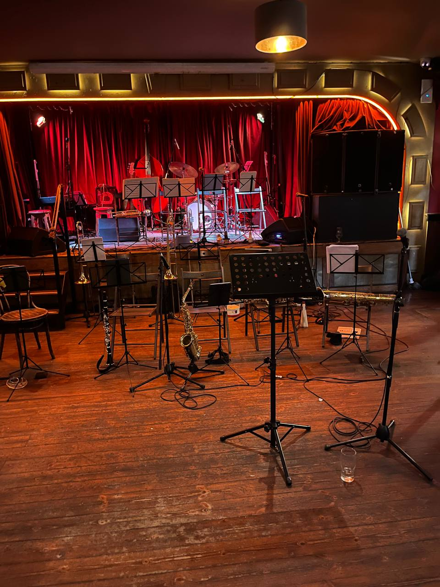
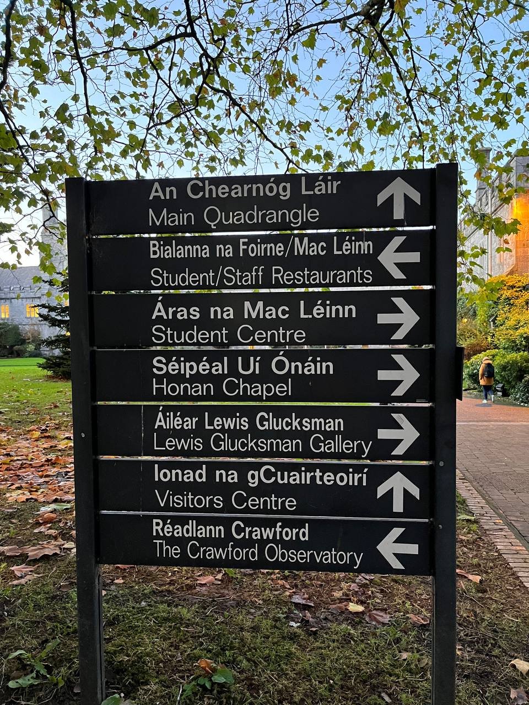

<h1 id="post-title">An Chéad Bliana in Éirinn / The first year in Ireland</h1>
<time id="last-modified">2023-07-23</time>
<tags>personal</tags>

It's been a year since I moved to Ireland, and I thought I could as well write a recollection
to remember the good moments of that year (there are many!) and reflect on them.
In short, I like it here, and I'm grateful to everyone who helped me on the way.
There are many great people I wouldn't have met and many experiences I wouldn't have had
if I didn't come here. Here's a list of unrelated memories (mostly narrated in present tense, as an aesthetic choice)
and observations in vaguely chronological order.

 

## The leap into the unknown

I'm sharing the news with my friend: "I'm moving to Ireland next week!".
She asks me where exactly I'm going to live there, and I answer honestly that I have no idea yet.

"You are going to live there, and you have no idea where?".
I ask her how I can decide where to live until I see different places.
She agrees that my argument has merits but still seems to think that my idea isn't really well-thought-out.

In reality, it's the most well-thought-out idea in quite a while: I have a letter from the Ministry of Justice
that grants me a two-year residence permit. I already know from the letter header that "The Ministry of Justice"
is _An Roinn Dlí agus Cirt_ in Irish.
I also still fear that there are still pitfalls and that the whole thing will fall apart at the worst possible time.
After all, a visa application center in Istanbul rejected my application initially because they thought a letter from _An Roinn Dlí agus Cirt_ wasn't on their list of acceptable supporting documents.
An email exchange with the grand embassy in Ankara solved that — bless those people, I thought they'd just tell me to go away
but they actually made the application processing clerks do their job.

Hell, even collecting the prerequisite papers to apply for a permit required jumping through multiple hoops,
up to translating a form into another language and pretending that the English original is a certified translation
to get my signature notarized —	in many	places, notaries aren't allowed to certify foreign language documents.

Since there were difficulties at every step, I don't expect it to get easier. Even with a visa sticker
in my passport, I still fear that the government of Ireland will change its mind — that fear will only subside when I hold the residence permit card in my hand.

I board	a plane	in Istanbul. The flight	is absolutely uneventful, and after a few hours, I finally see green fields
and the	shoreline from the plane window. We land in Dublin, and its airport feels tiny by contrast.
I clasp	my passport and	my COVID-19 vaccination	certificate in my hand,	anxiously waiting for my turn
in a line of people from all over the world except the European Union. 

The border officer simply looks	at the visa sticker and	asks a few questions about my work. I expect to have to explain
it in detail and defend myself, but nothing like that happens. 
His final question is where I'm going to live. I feel that from a border officer, it's a trick question that can change my fate, but I have to answer.
I say that I will spend at least some time in Dublin, but I haven't decided yet where to reside. 
However, he writes the Dublin Garda station address in the "Register at:" field of the immigration stamp and lets me in.

My answer is not exactly a lie. My co-founder and an old friend of twelve years booked a place in Dublin for a day, and he arrived the same day an hour before me.
We haven't met in person before — we met online and worked together for a long time, but since I made it into the EU,
it was finally easy for us to meet in what we jokingly call "the physical world".

I want to notify him that my plane has landed but discover that my Turkish provider's SIM card has roaming disabled and my phone is only good for emergency calls.
Of course, I should have checked if it had roaming enabled — I just couldn't do it because the subscriber app was broken. Worse yet, my suitcase doesn't arrive
on the conveyor belt, and I have to figure out who can help with lost luggage issues. It takes half an hour more
to retrieve the suitcase, and I finally exit the airport. My friend is waiting outside, and his greeting is, "dude, I thought you got abducted or something".

When we arrive at the rental, we realize that we both have forgotten that Ireland still uses British power sockets, and none of us has an adapter.
However, compared to all the previous problems, it seems more like an excuse to walk around the city to find a store that has those adapters.

On our way back, we walk into a convenience store to get some snacks. The newsstand has a district newspaper made by the local community.
I buy it as a tangible evidence of freedom of the press that I have completely forgotten could exist — I'm happy to be in a place where you can print and sell a district newspaper.

## Cloich na Coillte

If you don't have any specific destination forced on you by external circumstances and you've never been to a country before,
you need some way to decide where to start looking for places where you want to stay. When my friend and I planned that trip,
we searched the Web for "best places in Ireland" and decided on Clonakilty. It looked nice from the pictures, was close to Cork
(where our lawyers live), and its name sounded kinda funny — a place famous for its kilt cloning industry? So, we booked a room there.

Now we leave Dublin and, after scenic train and bus rides, arrive at the destination. My friend is too tired to do anything,
but I really want to see around, so I head out for a walk.

I take a road out of town and just follow it without any specific plan, just to see what's there. It's late June, and days are very long
in summer at this latitude, so I have plenty of time to walk even on unlit country roads. I look at the road sign and understand
why that name sounds funny to me — Clonakilty is a phonetic corruption of _Cloich na Coillte_, and phonetic corruptions are doomed to sound funny.
Only later I'll learn that it means "stone of the woods" and how to pronounce it correctly, with a broad (velarized) 'i' in _coill_.

I walk close to the road edge and stroke the roadside grass with my hand. After I spent months without leaving big cities, that connection
to nature feels better than ever. Sometimes I run into a bush that has sharp thorns instead of leaves. Later my host will tell me that it's called gorse
and that the only reliable way to get rid of it is to burn it.

I reach a body of water with a slate wall built along its edge. I climb onto the wall to use it as a sidewalk. The wall is covered in small seashells —
it's not really a sight that I'm used to, as a person who lived most of his life deep inside a continent.
Soon I realize that I have actually reached the sea. For some time, I just watch the waves roll onto the sand beach
and look at the seaweed, shells, and jellyfish that those waves bring ashore.

In Xenophon's "Anabasis", the Greek trying to make their way home after an ill-fated incursion of Persia famously cry "The sea! The sea!"
when they reach the shore. I'm mostly just taken with the beauty of that place, but there's certainly a similar feeling as well:
the worst part of the ordeal is over, and there's a path forward.

On my way back, I sacrifice my hand to tear a small branch off of the thorny plant to dry it and send to my friend in a letter —
it's a bit of a running theme between us, for me to send her dried flowers or leaves from local plants I find in new places.

Upon return, I ask the host if she's up for a chat and bother her with questions about the local plants and wildlife that I've seen.
She tells me that the place where I've been is named Inchydoney Island (_Oileán Inse Duine_).
There are lots of more practical questions I'll need to ask her about daily life in Ireland, as a person completely new to the country,
that she'll helpfully answer, but at the moment, I don't want to think about those mundane things such as where to find a recyclable waste container
or how to get health insurance — my thoughts are occupied by the beauty of West Cork and nothing else.

## Blarney Street

I've just moved to Cork, and I'm trying to get familiar with it. To a person who's used to more grid-like cities, Cork is confusing.
What seems like a small street can easily turn out to be a road to a completely different, unexplored part of the city.

It also feels strange to discover places that felt as legendary to me as _Tír na nÓg_ before I came to Cork. I could guess that the "old sweet port of Cork"
mentioned in "The Irish Rover" was a real place, but I never imagined myself casually walking past it and occasionally seeing sailships there.
I might have read somewhere that George Boole taught in UCC, but accidentally discovering his bust on the UCC campus when I first walked into it,
and then stumbling upon the house where he lived near the river was a completely different experience. His contributions to what became known as computer science
are so fundamental, and his life is so far in the past now that he seems more like a mythical figure. But here, the plaque on his house and his bust in front
of his namesake library remind me that he was a real person after all, and walked these streets like I'm walking them now.

I keep exploring. Cork feels nice, but I still feel like the proverbial stranger in a strange land — like anyone who moved to a new city completely by himself
and doesn't know anyone yet, I suppose.

Now I'm walking  Blarney Street — allegedly, the longest street in Ireland. Frankly, it's a strange record — one of the causes is that many streets change their names
in the middle. Cork also has St. Patrick _street_ and St. Patrick _Quay_ in different places. For everyone's benefit, the city council should rename
one of them after St. Brigid to avoid confusion, but I digress.

The name seems vaguely familiar — soon I'll learn that the street leads to the road to Blarney, where the legendary Blarney stone is located.
But now I'm just walking around, and my estimate is that if I keep walking that street, I'll reach the place where I started.
The street is indeed long and largely empty, and I feel quite lonely there.

Finally, I see people. An old man and a young woman are sitting outside of a house and having a chat. I find it rude to just squeeze myself between them and a car parked
right next to the sidewalk, so I say hello to notify them of my presence behind them. They answer with "Hello, how are you?". The "phatic question as a greeting" pattern,
especially towards strangers, so I give them an actual response: "Oh, just exploring Cork". A genuine response to a phatic question and an obviously non-local accent
draw their attention and they shift the focus of the conversation from the book they were discussing to me — how I ended up in Cork, what I'm doing there, and so on.

They tell me that the clock of St. Anne's Shandon church is called a four-faced liar by the locals because its every face tends to show slightly different time
and suggest more places to explore. People — their neighbors from that street — pass by, and they greet those people and introduce me to them.
And those people's reaction certainly isn't "oh, not another foreigner in Cork".
Suddenly, the place feels like a welcoming community. It's not a long, unfamiliar street with occasional strangers anymore, it's a place where my new neighbors live
and I know I can come back and stop for a chat.

The setting sun is shining down the street as I'm walking back home. Cork is no longer an alien city where I don't know anyone at all,
and I'm no longer afraid to try making new connections.

<h2 id="moss-ivy-fern">Moss, ivy, and fern</h2>

Everyone knows that the national plant of Ireland is supposed to be the shamrock. Not that there's no shamrock there, but it's like the president
in a parliamentary republic — a nominal leader.
The real national plants of Ireland are moss, ivy, and fern. Moss grows on everything. Even rolling stones can probably gather it
if they aren't rolling fast enough.

Ivy grows on every vertical surface it can find. Walls are fair game for it, and so are palms and subtropical trees that would never meet ivy
in their natural habitat — a date palm wrapped in ivy is a rather eclectic sight. It's also so vividly green that if I saw it in a picture,
I would suspect that it's a plastic decoration rather than a real plant. 
 
Fern grows in every crevice — sometimes even in cracks in stone walls and in tree bark. Some fern species rapidly die off when it gets cold
and turn dark brown to regrow anew next year. Other species are evergreen in this climate where it never gets too cold.

A broadleaf forest full of ivy, fern, and moss still looks like something out of a fairy tale to me.

<h2 id="lepers-walk">Leper's Walk</h2>

Anglicized place names in Ireland come in two flavors: phonetic corruptions and literal translations.
After a while you learn to recognize the former and make educated guesses. For example, Ballintemple is _Baile an Teampaill_ —
"town of the church".
Sometimes phonetic contrasts that exist in Irish get lost in transcription. One common example is two different words that are rendered as "kil" or "kill" in English.
Killarney is _Cill Airne_, but Clonakilty is _Cloch na Coillte_. "Cill" is "church", and "coill" is "forest".
So the name of Killarney is not a call to violence against Arnie (whoever that Arnie is) but "Church of Sloes".

Literal translations are perfect for learning Irish from street signs. For example, Bishopstown is _Baile an Easpaig_ — literally,
"town of the bishop".

Sometimes English and Irish names just have nothing to do with each other. One time I saw a sign that said "Baile na mBocht" in Irish
and "Mayfield" in English. I stood there for a few minutes with a dictionary, trying to find if those words had any non-obvious meanings
that could come together as Mayfield. They don't — it's just that the original name — "Town of the Poor" — doesn't sound very nice,
and people invented a nicer English name.

Sometimes English names even get deceptive.
I wanted to check out a street with an attractive name — Lover's Walk. When I went there, I found that it had no footpaths but had a few turns
that made it quite dangerous for pedestrians due to poor visibility to motorists coming from around the corner.
Later I learned that its true name isn't pretty at all; it's _Siúlann na Lobhar_ — _lobhar_ means a leper or an ailing person in Irish.

It reminds me of Joseph Brodsky's book about Venice, "Fondamenta degli incurabili" (its English title is "Watermark").
Reportedly, there's no street in Venice named "Quay of the incurables", for better or worse — Brodsky made it up.
However, Leper's Walk certainly exists in Cork, I assure you. And if you want to see it for yourself, be careful there — I tell you, there is no footpath!

## The Rebel City

When I see crowds of people entering a store through the door clearly marked "Exit/Amach" in two languages, while the door marked "Entrance/Isteach"
remains unused, I'm always surprised at first. Then I remember that Cork is the rebel city and everything falls into place.

## The Modern Dharma Bums

I suppose many Irish people may underestimate how popular Ireland really is. At least two of my classmates claimed to have Irish grand-grandfathers
(I'll refrain from judging the veracity of those claims). I also knew a lot of people who were into Irish dancing and traditional music.
Some could argue that it's mostly superficial interest, or even cultural appropriation, but the point remains — not many countries
have a culture well-known around the world enough to have a cultural appropriation problem.

Not so many people get the idea to actually move to Ireland, but I wonder how many would if they had a chance to visit it.
I met one woman from Czechia who came to Ireland for holidays and was so mesmerized by the country that she called people back home
to let them know she wasn't coming back. I can relate — if I had a chance to visit Ireland before, I would have wanted to move to here as well.
My love for Irish literature and music was a big factor when I applied for a residence permit in Ireland of all places where I could,
but I didn't really know what to expect — I just wanted to escape.

Since then I've seen quite a few people who also ended up here more or less accidentally, and many were also looking to escape something.
Many fled from the war and death — I can hear them on the streets, and I'm glad they are safe. 
Others weren't in any immediate danger and wanted to escape the general unpleasantness of their native country, or their background there
such as an abusive family. Some of them became my friends. I'm glad my social circle here is a mix of Irish people and people from multiple different places —
I couldn't imagine locking myself into an "expat community" of any kind.

One night we were discussing Jack Kerouac's books in a bar — my friend from the USA, his friend from Italy, and I. That discussion went past the last call.
The American friend told us that he found a bottle of rather uncommon whisky that he was wanted to find for a long time and invited us to continue the discussion
at his place over said whisky. It's a rather funny coincidence that three people from three different countries gathered in Ireland to discuss Jack Kerouac
and that the experiences of the beat generation in the 1940s were still relatable today for us — three people who once hit the road to escape
the values and ideologies of the societies they came from that they radically disagreed with, and how that discussion itself sounded like something
that Jack Kerouac could have written.

## Vidi Aquam

The Latin mass is about to begin, and I'm standing in the organ gallery — I'm in the choir.

My original plan was to learn how to read Gregorian chant notation
and run way. The second part of the plan didn't work out — I stayed to sing almost every week. Since I could already read Latin and sight-sing, and I was familiar
with the Mass structure from my classical music studies,
the organist and choir director quickly "graduated" me from the beginners' group to the actual choir. The director turned out to be an amazing musician and a scholar,
and the choir was also full of nice and interesting people, I had no reason to run away.

Exactly when we sing the first note of the response, the sun illuminates the organ gallery and shines brightly on the page of my Parish Book of Chant with _Vidi Aquam_ — it's Eastertide. 

Many years ago, someone was probably standing exactly in the same spot where I'm standing and also responded to "Domine, exaudi orationem meam" with "et clamor mea ad te veniat".
He might have also been tempted to turn his head to look at a beautiful woman with a bright and ringing voice instead of focusing on the notes.
Unlike me, he was probably Catholic for real, rather than an atheist with a love for sacred music and the history of world religions who finds himself drawn to Catholicism for a reason beyond his own understanding.
I hope my hypothetical predecessor also loved what he was doing.

## The Burning Tree

Curraheen park is one of my favorite places to go for a walk. That day I decided to go there, and I'm glad that I was there — although I wish the story never happened.

That park has a huge oak tree. That day I saw smoke coming from the place where the tree grows. People were walking, running, and cycling past it,
but I felt obliged to take a turn and check it out. My thought was that some fools made a campfire near the tree and left, so I'd have to either
remind them about fire safety (if they were still there) or put out the fire (if they weren't).

The reality turned out to be much worse. The campfire itself was completely burnt out already, and the smoke was coming from the tree itself — its trunk
caught fire from it. There was no one around — whoever made the campfire had clearly run away to avoid responsibility.

That wasn't the first time I had to respond to a fire, and in the other cases when I did, I was equally surprised that no one but me even bothered.
One time I put out a literal dumpster fire — a rubbish bin near a supermarket door was burning, and I threw snow into it to put it out.
Clearly, the supermarket security personnel could see it on CCTV, and lots of people walked past it, but what were they waiting for to act —
for the door to catch fire?

In the other case, I was the first to report a fire in my apartment building. When I smelled that something was burning, I opened the door and saw that the entire stairwell was
filled with acrid smoke from burning plastic. It was obviously unsafe to even try to check what was going on without protective equipment, so I shut the door and called emergency services.
Later it turned out the fire was in a closet on the ground floor. So, by the time the smoke from it reached the seventh floor where I lived,
lots of my neighbors must have smelled it already, yet I was the first to report it.

Generally, I try to take responsibility for places where I live or hang around because I want them to become better places.
Here in Cork, I once discovered a castle ruin in a park that was full of broken glass and other rubbish.
The locals told me that no one really was taking care of that place.
I went there with rubbish bags and cleaned it up. Last I checked it was still reasonably clean — sometimes it takes just one person
to take the first step, and I hope I inspired other people to keep it clean.

But I digress. The tree was burning, but I couldn't see the true extent of the fire damage due to the dense smoke coming from it.
I took out my water bottle and started carrying water from the creek near that tree and throwing it on the flames.
After a few dozen water runs, the flames were put out and the smoke dissipated. Only then I could see that the trunk was, in fact, half-hollow already,
and it was still smoldering all over inside. If I left it like that, it would surely catch fire again when it dried out.
And if there was peat under the tree, then things could take a truly catastrophic turn.

Since the area of the smoldering wood was too large to put it out without a water pump, I could only do one thing
— call a fire brigade. Into the depths of the park, a place without a street address that couldn't even be directly accessed by car.
So I took a deep breath and made my first emergency call in Ireland.

An operator picked up my call in less than a minute, Frankly, I expected that they'd have a way to determine at least my approximate location from the cellular base station.
Unfortunately, it wasn't the case, and I had to explain where I was. "Is it in Bishoptown?" As if an average person knows the exact boundaries of Bishoptown.
Of course, if I was in a build-up area, I'd just tell them the street address. Instead, I had to settle for giving them the address of the nearest place
with an Eircode. By that time, I was seriously afraid that the fire brigade would just dismiss the call as fake and get me fined,
but the die was cast — I had to remain there and do my best to lead them to the tree.

Soon I received a call from the chief of the fire brigade. I told him the GPS coordinates of the place. I almost started to regret putting out the flames —
if I didn't, I could just tell them to look for a column of smoke. They called me again to tell me that they were near the Model Farm Road Childcare,
the nearest place with an address. I climbed the steep and slippery slope of the hill to get there, ran through the dense vegetation,
and indeed saw a fire engine. At last, the unofficial first responder had met the official ones.

I led the chief down the hill. I expected him to get angry at me for making him run around the hills, but he was certainly a cool and friendly guy.
Finally, we reached the smoldering tree, and he ordered the rest of the brigade to come down the hill.
Even after they emptied their backpacks of water into it, it was still smoldering, and they had to fetch more water.

On my way back, I met my friend outside of a pub. "Is there a smell of smoke coming from somewhere?", he asked. It was just me — I smelled of smoke badly
and really needed a shower after that.

The tree still stands, and I hope it will survive, but I also hope that more people will take responsibility for the places where they live,
and that all people will follow the fire safety rules in the future.

## CSM Big Band

The CSM big band is playing its last concert before the summer break. The club is a big too small for a big band, so half the band
is sitting below the stage, right next to the audience.

Their playing is great, but the audience itself is an experience of its own. Almost all people there are musicians themselves —
with some of them, I played together at jam sessions; some of them I saw on stage; and I know that many other people are from the school of music as well.

As an unwilling music school dropout, it's been a while since I was in a room full of wind players and so many musicians at once.
It feels like a place where I want to be — like home.

## An Ghaeilge

Learning the Irish language has been one of the most memorable experiences in Ireland for me. I could talk at length about unexpected Indo-European cognates,
inflected prepositions, initial consonant mutations, and other linguistic features that I found fascinating, but I'd better do it elsewhere.
Here I'm going to talk about my personal and social experience with learning it.

I was curious about Celtic languages for a long time, but from the outside they don't look very approachable.
If you don't know anyone who speaks the language you want to learn, it's impossible to guess whether the learning material
that you are trying to use is any good, or if you got it right. So, I just kept waiting for an opportunity to arise.
And finally it did arise — I was living in the home of the Irish language.

When I arrived, I knew almost nothing about it, save for the common Gaelic words that show up in toponyms a lot, such as _gleann_ and _loch_.
My first language input was street signs. That's the most visible indication that the language is here — most signs are bilingual.

Even just from those bilingual signs, one can learn some words and piece together some morphology and syntax. One of the first words I learned that way was _críoch_ ("end").
When I saw a road police car with _póilíniú bóithre_/"road policing". written on it, I understood that _bóithre_ must have been the genitive case of _bóthar_ ("road").
But it feels strange to experience a living language in its own native country in the written first before you get to hear it spoken.

Since road signs come without a pronunciation guide, the sound of those words was a puzzle. Like, what's that _th_ in _bóthar_ — is it like "t" in "tip",
like "th" in "think", or..? In reality, it's like "h" in "home", and the reason it's written "th" is that in Irish, "h" after a consonant marks a phonetic process called _séimhiú_ — <wikipedia>lenition</wikipedia>,
that turns occlusive consonants into fricatives.
And "mh" in _séimhiú_ is pronounced /v/. It all made perfect sense when I learned how that process works and how it evolved, but at first it confused the hell out of me.

One of my first awkward encounters with Irish phonology was picking up Irish names by ear.
When my Clonakilty host wasn't home, her friend dropped by and asked if I could pass a gift to her. She told me her name and my thought was "she-who?!". "She-wohn"?
"Siobhán", of course — "S" before and after front vowels (i/e) is always /ʃ/. But at the time there was no way I could have spelled it correctly if anyone asked me to.

My Clonakilty host was also my first Irish teacher. I would take pictures of signs and ask her what they meant.
I showed her a picture of a house with a sign that said _An Teach Bán_ and asked what it meant. "The white house", she told me. "_Teach_ is "house". I'm _bean an tí_ — woman of the house".
That's an important lesson in syntax. The genitive case of _teach_ is _tí_. Adjectives come after nouns. "X of the Y" constructions don't require a preposition,
just the definite article (curiously, there's similar syntax in Arabic, like in "Al-Kitab al-Jabr" — "the book of the balancing" —
the mathematical treatise of Muhammed al-Khwarizmi that gave algebra its name).

She also told me that the accent over a vowel is called a _fada_,
which is the Irish for "long", and I could hear that _á_ is not only longer, but also closer to /ɔ/.

From that point, I had to do a bit of exploration to move forward with learning Irish. 

The community of Irish speakers is a bit of an unintentionally secret society. Not many people initiate conversations with strangers in Irish, and you don't hear it on the streets any often,
so you may not know that someone speaks it until you meet them at an Irish speaker gathering like a pop-up Gaeltacht, or someone tells you. Then you know something about them that most people may not know
because they don't really care: that you can ask that waitress "Cupán caife, le do thoil", or say "Dia duit!" to that old man and hear "Dia 's Murie duit!" back.
Once you know some people from that community, you surely will know a lot more of them very soon, but you need to find them first.

When I moved to Cork, I saw a sign about the Mass in Irish on the Church of St. Peter and Paul and guessed that it's the best chance to hear the local Irish.
That church is tucked away in narrow back streets, so without my habit of exploring cities, I might have never found it.
No matter what one's religious beliefs are, religious literature is an excellent source of parallel texts.
That church turned out to have Mass leaflets with all the fixed parts and the daily readings, which was even better because I could listen
and map the pronunciation to spelling. It was easy to figure out from its place and the structure that "_A Thiarna, déan trócaire; A Chríost, déan trócaire_"
is "_Kyrie eleison; Christe eleison_", for example. "_Is naofa, naofa, naofa thú..._" is obviously "_Sanctus, sanctus, sanctus est..._".
At first I used to routinely get irrecoverably lost while trying to read and listen. After a few months, I could confidently keep track of the text
even if I didn't understand most words.

People I met there told me about conversation groups, so I started attending their meetings — thankfully, they were very accepting of me. For a beginner, attending meetings of fluent speakers
is more of an exercise in listening, especially when the vocabulary and the grammar of the language is very different from anything you already know,
so it takes quite some time before you can add anything to the conversation at all.
I have to admit that I certainly annoyed quite a few people with grammar questions. I sometimes forget that not all people are language nerds,
and many speakers are exclusively interested in aspects of the language other than its grammar. And the communicative aspect — the original function of a language —
is not the most important part either.

Indeed, the _utility_ of speaking Irish is, at the moment, negated by the fact that all its speakers also speak English. I had one of my first _transactional_ monolingual Irish conversations
with a bookstore employee only because her colleague in their other branch told me that she was a fluent speaker. It's really quite funny how if you are learning
a language that doesn't see much daily use in most areas, you are likely to learn the words for "lenition" or "verbal noun" before you learn how to ask
how much something costs. Speaking English is perfectly enough to fulfill one's communicative needs in Ireland.

Now, I'm one of those people who are interested in languages for their own sake — as systems of symbols. My interest in Old Irish gets me weird looks even from modern Irish speakers.
However, the languages I actually spoke before (as opposed to reading them and knowing about their grammar) were languages of former and current empires,
and my thinking about languages as human phenomena was largely shaped by that. Personal experience with a language that became a minority language due to a colonial past changed my thinking completely.

Thankfully, I avoided the worst types of imperialist thinking — that some languages are inherently superior to other, or that some languages aren't even languages at all,
but rather corrupted forms of the real, superior language. Yet I used to find it difficult to relate to people who were putting effort into keeping endangered languages alive.
When I learned the history of how exactly languages formerly dominant in large regions were driven to near extinction, that made me understand the problem
at the intellectual level, but Irish was my first _personal_ experience with such a language.

For the Irish people who speak it, it's certainly a way to connect with their own identity and their past. For some, undoing the damage done to the language
by the imperial government before Ireland won its independence back and getting over the colonial past is a big factor.
For others, the political role of a language for a country's independence is less important, or maybe not a factor at all.
I think for all people I met who go out of their way to find opportunities to speak, listen to, and write in Irish when they could easily be using English instead,
it's a cultural treasure and a link to a living tradition and the language community.

Since I'm not Irish, the identity part is not a factor for me. A link to the past and a tradition is a factor now, however. I might have never discovered _sean-nós_ singing
if I wasn't hanging out in the Irish speaker community, for example — and I loved it when I discovered it. There's a long literary tradition and a modern literary scene
with many wonderful poets and writers, too. The language was the key to that culture for me — to the culture I wouldn't even have known about otherwise.

One unusual and unexpected experience was that being a _foreign_ speaker of a minority language makes you something of a living curiosity. 
Some people clearly hear a non-native speaker first the time in their life and start wondering where that accent may possibly be from.
I try to speak Irish to all locals I meet, often starting with asking them if they speak it (_An labhraíonn tú Gaeilge?_/_An bhfuil Gaeilge agat?_).
One time I asked a person that question and received no reaction, so I thought my pronunciation was incomprehensible to her
and repeated the question slower. It turned out she heard and understood the question first time, she just wanted to double-check that
she was indeed hearing a non-native speaker and wasn't imagining things. More than one, time people even alerted other people around
— "Look, this guy is not from Ireland, and he speaks Irish!".

Another thing of note for Irish is that it has three different dialects. It's amazing how such a small country has three dialects.
But what was truly surprising to me is that dialect differences do not divide people. I haven't heard anyone say that
the other dialects are _wrong_. For beginners, that does create difficulties, since they need to get familiar with every possible pronunciation.
I guess I'm lucky to be hearing all three — the locals in the conversation groups speak Muster Irish, there are some people
who moved here from Connacht, and the teacher in the night course in UCC is from Belfast and thus speaks Ulster Irish.

When my language skill progressed enough to make any conversations, I also found the experience of belonging to a small language community.
When Irish-speaking people meet another speaker, even not a very fluent one, their reaction is generally positive, sometimes even joyous.
For many of them, meeting another speaker is not merely meeting a person they can communicate with (they could do it in English) — it's meeting someone
who has something in common with them that is personally, emotionally important to them.

It's now personally, emotionally important to me as well, not least because it was the language of a welcoming community. I'm always glad to meet its speakers,
not just because I can practice with them, but because I share the language with them that I came to love. Sometimes it's just a very brief interaction,
just two people with [_fáinní_](https://en.wikipedia.org/wiki/F%C3%A1inne) exchanging a few words on the street. However, I also made deeper connections with people that I might not have made
if it wasn't for the shared language and the love of that language.

However, the reason why such random encounters and connections feel so precious to speakers is exactly that the community is so small.
It's certainly growing and more young people are taking up the language, but for now it's still small. If the English language and its cultural tradition
are like huge trees that will stand for centuries without anyone's help, small languages are more like flowers — fragile and vulnerable,
that can die unless people nurture them together.

And that is probably the most unusual part of all for me — that the relationship between a person and a language can be mutual.
Arguably, a vulnerable language needs its every speaker to survive and grow. Even mere existence of a growing number of those who speak
it as a second language can help it to be seen as more prestigious. If me enticing more people to speak Irish helps it grow and,
I hope I'm giving something back to the language itself, not just enjoying learning it and reaping the benefits of belonging to its community.

<h2 id="one-year">Bliana amháin</h2>

How do you end a story like this? There's nothing inherently special about the one-year mark. An "achievement unlocked" postcard doesn't arrive in your mail.
All such marks are arbitrary and only significant as far as we assign significance to them. Luckily, there are quite a lot of people who ascribe significance
to astronomical cycles, so many things do come to a full circle at one year mark.

The South of Ireland Band Competition that is held in Clonakilty in early July was the first musical event that I attended in Ireland.
Since I stayed in Clonakilty at the time, it was easy to go there — just walk to the community college. At the time, when I arrived in Ireland without any instruments,
after having spent months not playing, hearing so many wind bands was a breath of fresh air and a connection to my own past that I had to leave behind.

This year I decide to go there again — both to listen to the bands and to visit Conakilty.

I was born in a large city and stayed in large cities since then, so I haven't had a small town to feel nostalgic for, unlike people who moved to big cities later in life.
I unexpectedly acquired one much later — Clonakilty became such a town for me, since it was my first real experience of Ireland. A foster hometown, if you will.
I don't go there often because there are so many places I still haven't explored, but I always enjoy visiting it, walking those streets again,
and going to Inchydoney island, when time allows. I also remain in contact with the woman that I rented a room from during my stay there, and we meet for a chat once in a while.

So, I board the first morning bus to Clonakilty and watch the now-familiar places pass by. The street I didn't know was named Washington street when I first rode that bus.
Victoria Cross. Bishoptown — _Baile an Easpaig_. Bandon — _Droichead na Bandan_ — the Bandon river bridge town. The vividly green fields.
Clonakilty's main street is closed due to the band festival, so the bus driver drops me off near the bridge. I walk past the distillery towards the main street,
then head to the Clonakilty Community College where the competition is held. It's slightly funny to see bands play in a gym under a basketball net.

As members of the bands enter, I recognize many people that I haven't seen since past year. Many young members have visibly grown up since then. Some who were beginners
are taking solos now. The wind band scene is certainly vibrant here.

I head off to see street performances and hope to see my favorites from the past year. I watch a few bands play on the central square — all very nice,
but one of my favorites wasn't among them. The previous time they played away from the town square, down the road, so I decide to look around.
To my surprise, I come just in time — they are there and have just started playing.
I stand in the back rather than in front of the band and their music stands are visible to me. I find myself following the trumpet parts.
Even though I haven't played in an orchestra for a while, the instinct remains — if I see a part and the band is playing, I start watching where it is
and counting rests.

I buttonhole the conductor to thank him for the great performance. He remembers me. "We were talking here in this exact spot last year, weren't we?"
Yes, we were. I hope we'll meet next year as well.

I stay in that spot for one more band. They are a lot more amateurish but it's clear that they like playing together and it's fun to listen.
Then I leave to just walk around the streets. Listening to music intently for hours is a pretty exhausting activity if you listen to every part,
every chord, want to catch every solo and pay attention to every detail of the performance.

As I walk around, I reflect on my own musical life as an instrumentalist after I moved to Ireland. The scene was oddly welcoming to me ­— I still have no idea why.
Why did the guy who sold me his old clarinet give it to me for a months-long test drive and trust me not to run away with it, for example?
I have had a lot more opportunities to play jazz in small groups and improvise than ever before. I've met lots of cool people and most of them are very supportive,
even though I'm not actually good at what I do. When I moved away, I was mentally prepared to have no chances to perform anywhere at all,
but in reality, I have performed more here than ever before, and I enjoyed that more than ever before as well.
I even played Irish traditional music on the clarinet at an Irish speaker gathering — I found it amusingly fitting that I was a non-native speaker of Irish
and my instrument was also foreign to that music.

On my way to the bus stop, I meet the woman that I rented the room from when I stayed in Clonakilty. She sees my _fáinne_ and we exchange a few words in Irish about it.
She asks me why I haven't told her that I was there. I haven't told anyone because I knew I'd be busy at the band festival.
She says I should tell her next time I'm there. I will certainly go there again — it's my foster small town now, after all.

