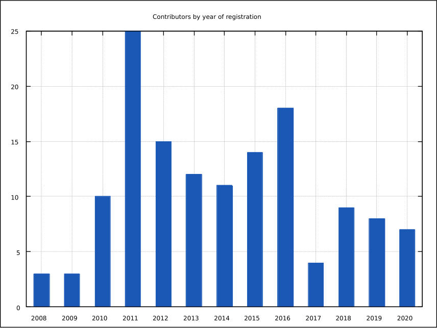

<h1 id="post-title">Can non-federated code hosting replace GitHub?</h1>

<time id="last-modified">2021-08-25</time>
<tags>web, programming, self-hosted</tags>

You guessed my answer right: I believe federation is the only hope for decentralizing developer collaboration.
To back up this claim, I examine contribution patterns in a project that was moved
from a self-hosted MediaWiki <em>to</em> GitHub—the repository with VyOS documentation. The key finding is that most contributor
accounts are older than the repository, so ability to use an existing account for contributing was likely crucial
for their decision to contribute.

[VyOS](https://vyos.net) is a free (as in freedom) Linux-based OS for enterprise and telecom routers.
Since its users are enterprises, managed service providers, and networking geeks, it's already quite niche.
It still has quite a lot of users despite being niche, but most aren't developers: there are very few people who
are network admins and programmers at the same time, so even hiring in that field is hard, and community contributors
to the code are precious.

When your project is niche and the developer/user ratio is low, you need all network effect you can get to even
hope to start getting contributions. However, this applies to most projects. Most project in the world,
my personal projects included, don't have and will probably never have even a dedicated contributor community,
and occasional contributions<ref id="drive-by">Let's avoid the derogatory "drive-by contribution" term.</ref>
is best they can expect.

Many ecosystems still reside completely within GitHub. Some use it as a _de facto_ standard place to store package sources
and contribute to the repository, like [OPAM](https://opam.ocaml.org) or [nixpkgs](https://github.com/NixOS/nixpkgs).
Others, like [Elm packages](https://package.elm-lang.org/) seem to have a much harder lock-in.

For any indivisual user and project being in a place where all potential contributors can easily start contributing
is a huge benefit. I doubt anyone really thinks it's good to have the entire free and open-source software ecosystem
locked into a single service operated by a commercial company—the main concern is if they will have any contributor
activity if they move away from the current de facto standard code hosting platform—Microsoft GitHub.

For the [VyOS documentation](docs.vyos.io) we already know that answer. The source code of VyOS has always been on GitHub
since the project inception in late 2013, but the documentation originally was in a
[MediaWiki installation](https://web.archive.org/web/20180918193608/https://wiki.vyos.net/wiki/Main_Page).
There are lots of good things about MediaWiki and it has lots of very under-appreciated features: categories,
templates, even semantic extensions. When the project started getting more popular, we also started having spam problems
so we had to implement progressively stricter anti-spam measures, but originally we even had anonymous editing allowed.

Still, even in its days of unrestricted anonymous editing, almost no one but the maintainers ever edited it.
I dubbed it a "free encyclopedia no one bothers to edit". Even as we introduced anti-spam measures, we offered everyone
exemption from those measures if they asked. That didn't help: it still had zero contribution activity, while the source code
was getting a slow but steady stream of pull requests.

In September 2018 we finally made a decision to migrate the wiki content to Sphinx hosted on [ReadTheDocs](https://readthedocs.io)
and its source stored on GitHub.
That was the turning point in its history: it's got [over a hundred contributors](https://github.com/vyos/vyos-documentation/graphs/contributors)
in these three years—an order of magnitude more than the wiki had between October 2013 and its end of life.

There are some patterns in the contributor activity:

* Most people who contributed to the docs never contributed to the code.
* Most contributions are small: typo fixes and single-paragraph rewrites, or command examples.
* Most accounts are old.

The last point is the one I want to discuss. When we made the migration and saw the contributor activity go up, I started wondering:
have we incited people to register on GitHub? Have we dragged them into the platform that is a prime example of corporate centralization
of the Internet and the FOSS ecosystem?

And the answer is: no, we didn't. I've thrown together a [quick and dirty script](https://github.com/dmbaturin/scripts/blob/master/github-contributor-stats.py)
to fetch the following information about contributors to that repository: login name, number of contributions, and the year when their accounts were registered.

I've been mostly interested in the last one, and here's the chart.

As you can see, around a half of the accounts were registered before the VyOS project itself started in 2013. Only a small number of people registered after that specific
repository was created. Of course, some people who contributed to the docs _are_ established contributors to the code, but there aren't many of them.

My only interpretation of this data is that for most people, especially for casual contributors, being able to contribute using their already existing
account is the most important factor in their decision to contribute. They will not register single-purpose accounts for just one project
on an independent code hosting platform.

I'm holding my breath for the federation support in Gitea. I'm certain that until people can contribute to repositories on multiple instances
without registering there, nothing is going to change. But when choosing an independent service like [Codeberg](https://codeberg.org)
or a self-hosted platform no longer requires people to make an account they can't use for anything else, then centralization may finally start to erode, and I hope it will.
