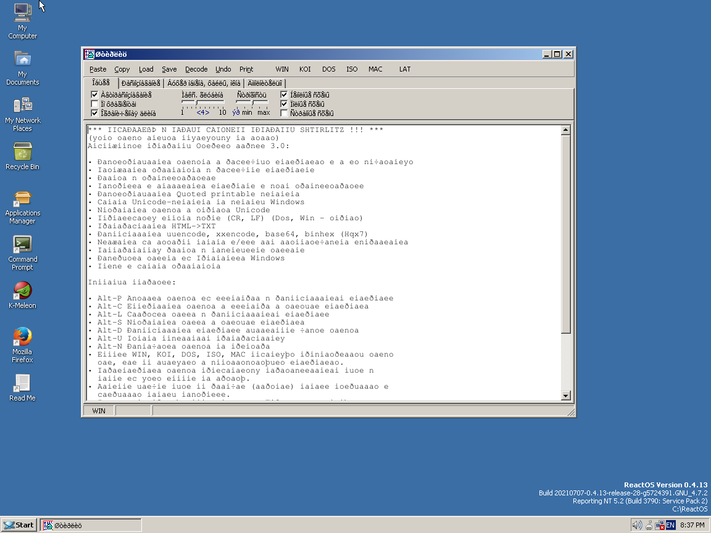
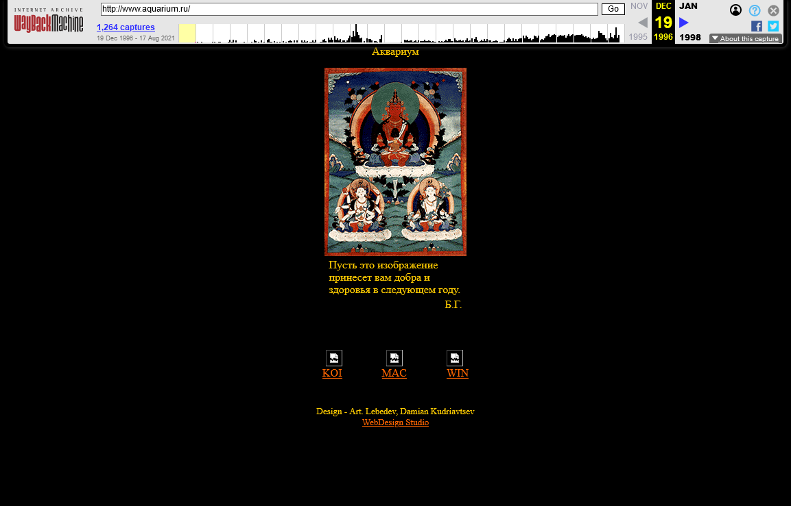

# Life before Unicode
<time id="last-modified">2021-08-21</time>
<tags>programming, history</tags>

Unicode definitely added a lot of complexity to string handling,
and people who use languages with ASCII alphabets exclusively may think it's unjustified.
However, I'm a non-ASCII language speaker who's old enough to remember the alternatives,
and the alternatives are far worse than the complexity of Unicode.

For the record, I got started with computers in the early 2000's Russia. The Russian language
uses an alphabet based on the <wikipedia>Cyrillic script</wikipedia>.
As far as non-ASCII languages go, it's relatively simple: 33 letters, each has uppercase and lowercase versions, and
the upper/lower case transform is invertible. Since it's just 33 letters, you can fit it in an 8-bit encoding
and still have room for pseudographics.

The catch is that, for a time, Russian had _three_ almost equally common encodings.

One reason is a complicated history of the Soviet Union and computing—it's been isolated from the rest of the world,
and all organizations that produced computer hardware and software were government-owned, so they could impose a standard on them.
When the USSR broke down, the market was quickly captured by Western hardware and software<fn id="piracy">Mostly by pirated copies of that software
because no one had money to pay for licenses anyway, and copyright enfocement was almost non-existent in the 90's</fn>
because no one was making Soviet hardware anymore anyway.<fn id="soviet-hardware">That hardware was too outdated to keep producing in any case,
and couldn't complete in a free market.</fn> Private software companies started to produce software for imported OSes right away, too—at first
that meant DOS.<fn id="mac">Apple hardware was almost non-existent in Russia at the time because of its price, it's still very niche.</fn>

Old Soviet systems _mostly_<fn>IBM mainframe clones (<wikipedia>ES EVM</wikipedia>) used EBCDIC, of course.</fn>
used an encoding named <wikipedia>KOI8-R</wikipedia>. KOI stands for "Код Обмена Информацией" (Information Interchange Code), 8 means 8-bit,
and R means Russian (there's also a Ukrainian version named KOI8-U, the Ukrainian alphabet is distinct from Russian).
That encoding is, to put it politely, mildly insane: it was designed so that stripping the 8th bit from it leaves you with a somewhat readable
ASCII transliteration of the Russian alphabet, so Russian letters don't come in their usual order.

DOS used <wikipedia>CP866</wikipedia>. It's rather less insane, maintains the order of letters, and covers a few languages with Cyrillic alphabets.
What happened when Windows came? Microsoft developed a new encoding, <wikipedia>Windows-1251</wikipedia>.

Did they add seamless transcoding for old files from DOS? Of course not! A Russian version of Windows effectively used _two_ different encodings:
native Windows parts used Windows-1251, while the DOS subsystem still used CP866.
If you typed your programming assignment in Turbo Pascal<fn id="turbo-pascal">Which is a DOS program.</fn>
and wrote any comments in Russian, you could not open it in notepad.exe for printing—the comments would end up unreadable.

So, things were bad enough without the Internet, but when Internet connectivity started to get more accessible, things got much worse
because you wouldn't even know what OS a file originally came from.

Additionally, the Internet runs on UNIX-like systems. Proprietary UNIX hardware (Sun, HP etc.) was too expensive for most companies,
and the rapid growth of the Internet in Russia coincided with the rapid growth of open-source software adoption, so in practice
UNIX-like meant FreeBSD and Linux.
This means we can ignore the fact that proprietary UNIX systems used <wikipedia>ISO 8859-5</wikipedia>—that fact didn't affect an average person.
Only the encoding choices of free and open-source systems did.

FreeBSD and Linux used... KOI8-R, the Soviet encoding.<fn id="communism">The ultimate evidence that open source is like communism.</fn>
The main reason is that the old Soviet UNIX-like systems used it (e.g. <wikipedia>DEMOS</wikipedia>, and when old installations were migrated
to the new OSes, it was probably a natural choice. Besides, KOI8-R was _not from Microsoft_. Linux had support for Windows-1251 for a long time,
but I haven't seen anyone use it—the default was KOI8-R and everyone went along with it (myself included, though I switched to Unicode as soon
as it became an option).

So, by the late 90's there was a situation when most web, email, or IRC servers were running UNIX-like OSes with KOI8-R, while most workstations
were running Windows with Windows-1251. That made encoding confusion a part of the daily life for most Internet users.

People wrote programs for heuristic encoding detection and transcoding, such as Artemiy Lebedev's [email decoder](http://web.archive.org/web/20050705084203/http://www.artlebedev.ru/tools/decoder/)
and Vsevolod Lukianin's [Shtirlitz](http://web.archive.org/web/20020118155228/http://www.shtirlitz.ru/).<fn id="stierlitz">Named after the hero of
<wikipedia>Seventeen Moments of Spring</wikipedia>—a cult TV series about a fictional soviet spy working in the nazi Germany.</fn>

Ironically, trying to run Shtirlitz (or any other Windows program with Windows-1251 text baked in) on a system that comes without Windows-1251 support produces the very issue with garbled text
it was supposed to solve. It's not a ReactOS issue—you will have the same problem in Microsoft Windows if it doesn't have Russian language support installed.

Speaking of Windows, mounting Windows drives on Linux had its own challenges. If you used KOI8-R in the Linux system, you'd have to remember to specify `-o iocharset=cp1251`
if you wanted Russian file names to be readable.

Web browsers didn't have encoding detection for quite a while either, so most websites offered multiple versions in different encodings.
That, oddly, made a splash page a useful part of the website rather than an anti-pattern: since you couldn't count on immediate readability of normal text
in the viewer's web browser, you had to present the website description and encoding selection menu in the form of images.

For example, this is a [1996 website](http://web.archive.org/web/19961219041746/http://www.aquarium.ru/) of <wikipedia page="Aquarium (band)">Aquarium</wikipedia>, one of the oldest Russian rock bands.

Website encoding auto-detection was a solved problem when I started browing and making websites, so I only saw encoding choice menus on websites that were outdated even in the early 2000's.

However, IRC had that problem for much longer. The IRC protocol has no notion of encoding, everything it a byte stream to it.
The RUSNet IRC network had a modified IRCd capable of automated transcoding, and used different ports for clients with different encodings.

They mentioned those port settings very prominently in the connecting instructions, but newbies messed it up all the time and ended up sending
unreadable text to channels. Experienced users learned to recognize common encoding issues visually and some could even _reply_ in the encoding
readable for the unfortunate newbie (though most simply sent them a link to the relevant tutorial section).

Obviously, I'm very happy to see Unicode win because none of those problems exist in a Unicode world.

 

