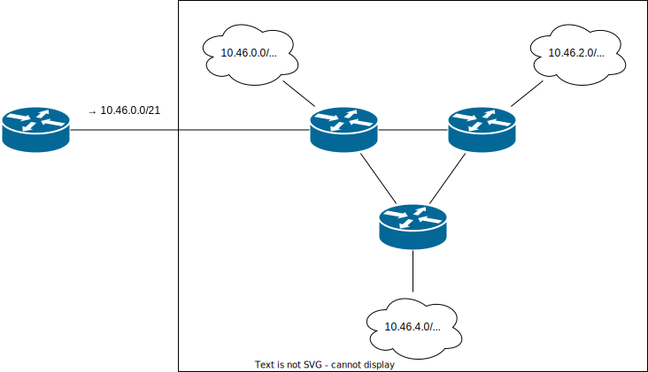

# Private network design basics

<time id="last-modified">2022-01-16</time>
<tags>networking</tags>

People without much networking experience may think that network design is something that is done for large organizations
by highly experienced specialists with fancy titles, while small networks
don't need any design at all. However, most networks start small and grow larger than anyone might have planned,
and the "no design" approach quickly shows its limits. Worse yet, changing the design of a production network
is much harder than building a network from scratch—even a very small network can take hours to reconfigure for a new addressing scheme
and ensure that everything is working correctly. Luckily, if you know a few facts and principles,
you can avoid most mistakes that take a lot of effort to fix.
If you are starting a network and want to get it right, read on.

## Choosing addresses

In the public Internet, address space allocation is handled by the <abbr title="Internet Assigned Numbers Authority">IANA</abbr> and 
<abbr title="Regional Internet Registries">RIRs</abbr>. All new allocations and transfers of existing addresses must be approved
by a registry in your region: for example, if you are in Europe or the Middle East, your registry is RIPE NCC,
while in North America it's ARIN. No organization owns its IP addresses—they only get a permission to use them as long as they
are members of their regional Internet registry and pay membership fees.

It's not possible to get more addresses simply by paying the RIR, either. Back when the IPv4 address space wasn't completely exhausted,
you still had to justify their use to get more addresses allocated to you. Now there is no unallocated IPv4 space, so the only way
to receive public IPv4 addresses is to join a [wait list](https://www.ripe.net/manage-ips-and-asns/ipv4) and wait
for someone else to return their addresses back to the RIR, or to purchase them from someone else<fn id="address-purchase">Since addresses
aren't property, technically they do not sell them to you, but rather ask the RIR to re-allocate them to you.</fn>

So, if you need IPv4, you are going to use addresses from the _private_ space. In 1996, IANA allocated three large networks specially
for private use. They are defined in the [RFC1918](https://datatracker.ietf.org/doc/html/rfc1918), "Address Allocation for Private Internets".
An internet in that context is simply a set of interconnected networks, as opposed to the public Internet with a capital "I".

Those networks are:

* 10.0.0.0/8 (10.0.0.0 - 10.255.255.255)
* 172.16.0.0/12 (172.16.0.0 - 172.31.255.255)
* 192.168.0.0/16 (192.168.0.0 - 192.168.255.255)

For some reason, there are many misconceptions about those networks. Some people are unaware of the 172.16.0.0/12 network altogether,
or think it's 172.16.0.0/16 (172.16.0.0 - 172.16.255.255), much smaller than it really is. Other people think that any address that starts
with 192 is a private address, but that is completely wrong: for example, the 192.1.0.0/16 network belongs to
[Raytheon BBN](https://www.raytheonintelligenceandspace.com/capabilities/bbn)<fn id="bbn"><wikipedia>BBN Technologies</wikipedia>
played an important role in the early history of the Internet.</fn>.

One possible reason why some beginners are confused by the 192/8 network is that the 192.0.2.0/24 network is also reserved—it's one of the three
networks that [RFC5737](https://www.rfc-editor.org/rfc/rfc5737.html) reserved for examples and documention.
Addresses from 192.0.2.0/24 (TEST-NET-1), 198.51.100.0/24 (TEST-NET-2), and 203.0.113.0/24 (TEST-NET-3) must not be used
in any real-world network so that they are safe to use in examples instead of real public IPv4 addresses.
However, most of the 192.0.0.0/8 network is in real use. Even the network right next to TEST-NET-1, 192.0.3.0/24, is allocated to a real company by ARIN.

There are more reserved networks that you can find on the [IANA website](https://www.iana.org/assignments/iana-ipv4-special-registry/iana-ipv4-special-registry.xhtml).
Only those marked "Private-Use" can be used in private networks—the rest have their own special uses.

For example, the 100.64.0.0/10 network is allocated for use with carrier-grade NAT by the [RFC6598](https://www.rfc-editor.org/rfc/rfc6598.html).
Technically, you are free to use it in your private network since those addresses are guaranteed to never appear in the public Internet.
However, it's not meant for such use—it's for ISPs who put their clients behind an ISP-operated carrier-grade NAT to conserve their IPv4 address space.
Thus if you connect to an ISP that uses CG-NAT, your WAN address will be from that network and it will conflict with your internal addresses.

Now we know that private networks should only use addresses from 10.0.0.0/8, 172.16.0.0/12, and 192.168.0.0/16 networks.
How to choose which one to use?

Technically, they are all equally good and the choice is arbitrary. However, there are some practical considerations.
Some networks are much more popular than others. For example, 10.0.0.0/24, 192.168.0.0/24, and 192.168.1.0/24 are very common
default networks in consumer-grade routers. Thus, if you connect to a public WiFi access point that uses 10.0.0.0/24
and you try to connect to your private network over a VPN tunnel, you'll end up with an address conflict.
Note that service providers and partners may also want to connect their own private network to yours,
so it's a good idea to minimize the potential for conflicts.

Some randomly chosen network, like 10.46.0.0/21, is much less likely to conflict with someone else's network
than those most popular networks or something nice-looking like 10.100.0.0/21. It's better to sacrifice memorability
to avoid troubles later.

## Subnetting

Now you know what ranges to choose your network from, but that's just the beginning. The next step is to plan how to use it.

First of all, it's always a good idea to choose a contiguous large block for your entire organization. Even if you don't need many addresses
right now, it will save you from troubles later.

If I were to pick a single subnetting motto, that would be "design for aggregation". Aggregation is the primary networking abstraction
and a key factor for configuration simplicity and efficiency.

There are [over 900 000 BGP routes](https://bgp.potaroo.net/as1221/) in the public Internet now, but most host systems only have a single
0.0.0.0/0 default route because they communicate with all networks through a single gateway and don't need to know anything
about the internal structure of those networks. Only autunomous system border routers may need to know about every independently-advertised
route on the Internet, while most routers only have a small subset of the full table.

Now consider a client computer or a third-party router that communicates with your private network over a single VPN tunnel.
To them, your network is a monolithic entity because with a single connection, they couldn't use any information about its internal structure
to optimize routing even if they wanted to.

If your network has three sites and each uses a different subnet (suppose, 10.0.0.0/24, 192.168.0.0/24, and 172.16.0.0/24), such a system
would be forced to have three different routes in its table for what is supposed to be a single logical network. In most cases,
there's much more configuration than just routes: firewall rules, QoS policies and so on. While routes can be advertised automatically
via dynamic routing protocols, policy configuration takes much more effort to automate. Most importantly, to a system with a single
connection to your network, there's zero benefit in knowing anything about its internal structure anyway.

By contrast, if you use a contiguous address block, you make it easy for other networks to avoid knowing anything about your network internals.

Of course, this is a very brief and basic introduction. Still, you can avoid many problems in the future simply by:

* Correctly understanding the private address space.
* Choosing a range that is less likely to conflict with other people's networks.
* Starting with a contiguous large block and breaking it down into smaller subnets, as opposed to starting with a small network and adding more of them.

 

